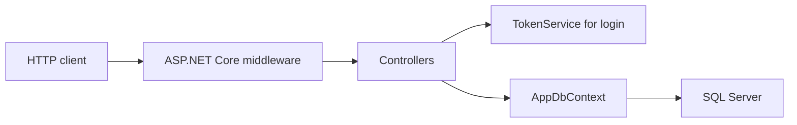

# Issue Tracker API

[](https://github.com/prathmeeesh/IssueTrackerApi/actions/workflows/ci.yml)

A C# / ASP.NET Core 8 REST API for tracking project issues, with JWT authentication, role-restricted project creation, comments, and audited status transitions.

## Overview

Issue Tracker API provides a backend for recording work against projects, assigning issues to users, and following each issue through a defined lifecycle. It demonstrates controller-based API development, EF Core persistence, authentication, and automated verification.

The current scope is an API, with Swagger UI for exploration. Project functionality is limited to creation; issue functionality includes creation, retrieval, assignment, and status changes.

## Key Features

- Public registration and login with BCrypt password hashing; new accounts receive the Developer role.
- JWT bearer authentication and Admin-only project creation.
- Issue creation with server-controlled initial status and creation timestamp.
- Issue retrieval, exact status filtering, and basic page/page-size parameters.
- Assignment of issues to user IDs.
- Comments attributed to the authenticated user.
- A controlled status workflow with an IssueHistory record for each successful transition.
- Swagger/OpenAPI documentation and automated authentication, workflow, and persistence tests.

## Technology Stack

| Area | Technology |
| --- | --- |
| Language and runtime | C#, .NET 8 |
| API framework | ASP.NET Core 8, MVC controllers |
| Persistence | Entity Framework Core 8.0.31, SQL Server, EF migrations |
| Authentication | JWT bearer authentication, HS256 signing, role claims |
| Password hashing | BCrypt.Net-Next |
| API documentation | Swashbuckle, Swagger/OpenAPI |
| Testing | xUnit v3, ASP.NET Core WebApplicationFactory, VSTest |
| Test database | SQLite in-memory, used only by the test project |

## Architecture

The application uses controllers, a token service, and an EF Core context wired through dependency injection.

| Component | Responsibility |
| --- | --- |
| Controllers | HTTP endpoints, authorisation attributes, issue workflow checks, and persistence calls |
| DTOs | Registration, login, project creation, issue creation, and comment creation inputs; registration/login validation |
| Models | User, Project, Issue, Comment, and IssueHistory records |
| Services | TokenService creates signed JWTs from stored user identity and role |
| Data | AppDbContext exposes the five entity sets |
| Migrations | The existing InitialCreate migration defines the SQL Server tables |
| Configuration | JwtOptions and startup validation configure token issuance and validation |

Business rules currently live in controllers. External write inputs use request DTOs, and server-controlled fields such as roles, IDs, authors, status values, and timestamps are assigned by the API.



## Authentication Flow

1. Register with an email address and a password of at least eight characters.
2. The API checks for an existing email, hashes the password with BCrypt, and stores a Developer account. Client-supplied roles are ignored.
3. Login verifies the submitted password against the stored hash.
4. TokenService returns a signed JWT containing the user ID, email/name, role, and a two-hour expiry.
5. Send the token using the Authorization header with the Bearer scheme.
6. The API validates the signing algorithm, signature, issuer, audience, lifetime, and positive integer user ID. Role checks then apply to restricted endpoints.

Login returns the token as a string, not an object with refresh-token fields. In Swagger's **Authorize** dialog, enter the token without the Bearer prefix.

Missing or invalid authentication returns HTTP 401. An authenticated Developer attempting to create a project receives HTTP 403. Refresh tokens and immediate token revocation are not implemented; the validator's default clock skew applies.

## Issue Workflow

```text
Open -> InProgress -> Resolved -> Closed
```

New issues start at Open. Only the next transition shown above is accepted; skipping stages, moving backwards, repeating the current state, or reopening a Closed issue is rejected with HTTP 400 and "Invalid status transition". Unknown statuses are also rejected. A missing issue returns HTTP 404.

A successful transition updates the issue and adds an IssueHistory record containing the previous status, new status, authenticated actor ID, and UTC timestamp in the same SaveChangesAsync call. This history covers status changes, not every project, issue, assignment, or comment operation.

## Data Model

| Entity | Stored information and ID references |
| --- | --- |
| User | ID, email, password hash, role |
| Project | ID, name, description, creation timestamp |
| Issue | ID, title, description, priority, status, creation timestamp, ProjectId, optional AssignedUserId |
| Comment | ID, IssueId, UserId, message, creation timestamp |
| IssueHistory | ID, IssueId, old/new status, ChangedByUserId, change timestamp |

These references are scalar IDs. The current EF model and migration do not define navigation properties or foreign-key constraints. Creation and assignment endpoints do not consistently check that referenced projects, issues, or users exist. Use existing IDs; referential integrity and project ownership controls remain future work.

## API Overview

Paths below are relative to the local API base URL.

| Method | Endpoint | Access and purpose |
| --- | --- | --- |
| POST | `/api/auth/register` | Public; create a Developer account |
| POST | `/api/auth/login` | Public; obtain a JWT |
| POST | `/api/projects` | Admin; create a project |
| POST | `/api/issues` | Authenticated; create an issue |
| GET | `/api/issues` | Authenticated; list issues with optional `status`, `page`, and `pageSize` query parameters |
| GET | `/api/issues/{id}` | Authenticated; retrieve an issue |
| PUT | `/api/issues/{id}/assign/{userId}` | Authenticated; assign an issue |
| PUT | `/api/issues/{id}/status?newStatus=InProgress` | Authenticated; request the next status |
| GET | `/api/issues/{id}/history` | Authenticated; retrieve status history for an issue |
| POST | `/api/comments` | Authenticated; add a comment |

The issue list defaults to page 1 and pageSize 10 and returns an array. Pagination does not currently provide a total count, stable ordering, or page-size validation. Project listing/editing/deletion, comment editing/deletion, and general user administration endpoints are not implemented.

## Testing

Run from the repository root:

```text
dotnet build --configuration Release
dotnet test --configuration Release --no-build
```

Latest local verification, 9 September 2026: `dotnet restore`, `dotnet build -c Release`, and `dotnet test -c Release` on Windows, targeting .NET 8.

| Check | Result |
| --- | --- |
| Build | Succeeded; 0 warnings, 0 errors |
| Passed | 55 |
| Failed | 0 |
| Skipped | 0 |

The run includes 3 token-service unit cases and 52 integration cases. Parameterised theory rows count as individual cases. Coverage includes valid and invalid workflows, persisted history actors, registration/login, password hashing, role restrictions, JWT rejection, server-controlled fields, project/comment DTO binding, and startup configuration validation.

Integration tests use the real ASP.NET request pipeline and disposable SQLite databases with generated test keys. They require no SQL Server credentials or running API. They do not prove SQL Server migration correctness, production connectivity, or SQL Server-specific behaviour. These are local results, not a coverage percentage.

See the [testing guide](IssueTrackerApi/docs/testing.md) for test categories, report commands, and remaining gaps.

### Continuous Integration

The [GitHub Actions workflow](.github/workflows/ci.yml) runs on pushes to main and pull requests targeting main. One Ubuntu 24.04 job installs the .NET 8 SDK, restores the solution, builds in Release, and runs the full test suite without rebuilding. A failed restore, build, or test fails the job.

```text
dotnet restore IssueTrackerApi.sln
dotnet build IssueTrackerApi.sln --configuration Release --no-restore
dotnet test IssueTrackerApi.sln --configuration Release --no-build
```

CI uses the same disposable SQLite databases and generated test keys as local tests. No SQL Server service, application credentials, or custom GitHub secrets are required. The workflow grants read-only repository access, disables persisted checkout credentials, and pins actions to verified release commits.

Hosted CI is enabled through GitHub Actions; the badge at the top of this README reflects the current status of the main workflow. SQL Server migrations, deployment, and production configuration are outside the workflow's current scope.

## Getting Started

### Prerequisites

- Git and a .NET SDK capable of targeting .NET 8, with the .NET 8 and ASP.NET Core 8 runtimes installed.
- NuGet access for package and tool restoration.
- A development SQL Server instance and a database you control, with permissions to apply the migration. SQL Server is needed to run the API, but not to run the automated tests.
- A local HTTPS development certificate. Where supported, trust it using the command below.

```text
dotnet dev-certs https --trust
```

### Clone and restore

```text
git clone https://github.com/prathmeeesh/IssueTrackerApi.git
cd IssueTrackerApi
dotnet restore
dotnet tool restore
dotnet tool run dotnet-ef -- --version
```

Cloning requires authorised GitHub access if the repository is private. The local tool manifest pins `dotnet-ef` to 8.0.31 to match the EF Core packages. The explicit [local-tool commands](https://learn.microsoft.com/en-us/ef/core/cli/dotnet) avoid depending on a globally installed EF version.

### Configure locally

Supply the required settings listed under Configuration before running the API or database tools. Set them in the environment of the shell that runs the commands, or use the project's development user secrets. In Visual Studio, right-click the IssueTrackerApi project and select **Manage User Secrets**.

Use your own development database connection and a new cryptographically random signing key. The project already declares a UserSecretsId. Development user secrets are loaded in the Development environment; no real values belong in committed configuration.

### Apply the database migration

From the repository root, with private configuration available:

```text
dotnet tool run dotnet-ef -- database update --project IssueTrackerApi --startup-project IssueTrackerApi -- --environment Development
```

This applies the existing InitialCreate migration to the configured database. Do not create a new migration just to initialise a clone. The application does not apply migrations automatically.

SQL Server database setup is a prerequisite for manual API use; it is not established by the SQLite test results.

### Run and explore

```text
dotnet run --project IssueTrackerApi --launch-profile https
```

The checked-in `https` launch profile selects Development and uses [local Swagger UI](https://localhost:7116/swagger). The general URL pattern is `https://localhost:<HTTPS_PORT>/swagger`; use the actual port printed at startup if your local settings differ. Swagger is enabled only in Development.

Register and log in through Swagger. New accounts are Developers. To exercise project creation on your own development database, a trusted administrator must explicitly set the registered account's stored role to Admin, then the user must log in again. There is no seeded Admin account or public role-assignment endpoint. Use the returned project ID when creating an issue.

## Configuration

Only configuration names are listed below; provide values privately.

| Purpose | Environment variable name | Configuration / user-secret name |
| --- | --- | --- |
| Required SQL Server connection | `ConnectionStrings__Default` | `ConnectionStrings:Default` |
| Required JWT signing key | `Jwt__Key` | `Jwt:Key` |
| Optional issuer override | `Jwt__Issuer` | `Jwt:Issuer` |
| Optional audience override | `Jwt__Audience` | `Jwt:Audience` |
| Hosting environment | `ASPNETCORE_ENVIRONMENT` | - |

Non-secret issuer and audience defaults are in appsettings.json. Startup rejects a missing connection string, a blank signing key or one shorter than 32 UTF-8 bytes, and a blank issuer or audience. Generate the key with a cryptographically secure generator; length validation alone cannot establish randomness.

Environment variables and development user secrets are supported. Neither .env files nor appsettings.Local.json are loaded automatically. User secrets are stored outside the repository and are not encrypted; they are for local development. Restart the application after changing JWT or database configuration.

See the [security configuration guide](IssueTrackerApi/docs/security-configuration.md) and [ASP.NET Core user-secret documentation](https://learn.microsoft.com/en-us/aspnet/core/security/app-secrets?view=aspnetcore-8.0).

## Security Notes

- Passwords are stored as salted BCrypt hashes. Public registration cannot choose a privileged role.
- JWT signing configuration and the database connection are externalised from source configuration. No usable default key or database credentials are supplied.
- Issue, project, and comment endpoints require bearer authentication; project creation additionally requires Admin.
- Comment authors and status-change actors come from the authenticated user ID.
- Current authorisation is role-based, not project membership or tenant isolation. Any authenticated user can access the issue endpoints.
- Login throttling, refresh tokens, immediate role-change/token revocation, and concurrency protections are not implemented.
- A former signing key was removed from reachable public `main` history during the 9 September 2026 history remediation. Treat any previously exposed key as compromised and rotate it wherever it may have been used. Unknown clones and GitHub cached commit views may still exist; see the security guide.
- The 9 September 2026 dependency audit reported no vulnerable packages for the application or test projects after .NET 8 patch updates. This is based on the NuGet advisory sources available at audit time.
- SQL Server tests, deployment hardening, and TLS operation have not been verified by the current test suite.

## Project Structure

```text
IssueTrackerApi.sln
.config/
  dotnet-tools.json
IssueTrackerApi/
  Configuration/
  Controllers/
  DTOs/
  Models/
  Services/
  Data/
  Migrations/
  Properties/
  docs/
  Program.cs
  appsettings.json
IssueTrackerApi.Tests/
  Infrastructure/
  AuthenticationTests.cs
  ConfigurationTests.cs
  IssueWorkflowTests.cs
  JwtAuthorizationTests.cs
  ServerControlledFieldsTests.cs
  TokenServiceTests.cs
```

## Future Improvements

The following are planned possibilities, not completed features:

- Add foreign-key constraints, referenced-record validation, and project membership authorisation.
- Add concurrency handling for status updates and a database-backed uniqueness rule for account emails.
- Improve existing pagination with stable sorting, bounded inputs, and totals; add richer search and filtering.
- Add SQL Server integration/migration tests and coverage for list filtering and concurrent requests.
- Add login throttling and a defined token/role revocation strategy.
- Add structured application event logging and request correlation beyond framework logging.
- Add deployment documentation and production hosting when a suitable environment is available.

## Author / Links

Prathmesh Pawar

- [GitHub](https://github.com/prathmeeesh)
- [Portfolio](https://prathmesh-portfolio.vercel.app)
